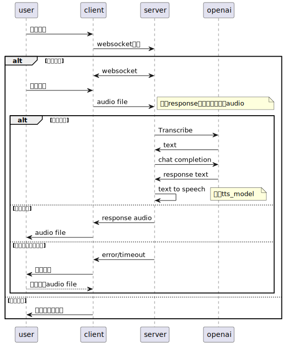

# AITalk
此项目旨在将ChatGPT打造成一个用于练习英语口语的虚拟好朋友，可以通过语音转化技术直接与其口语聊天

## 模块
每个模块功能的测试脚本和物料都放在script目录下
### 语音转文本
openai的Whisper模型提供speech to text的能力。
通过一下curl语句调用openapi的http接口测试[音频文件](file://./script/Sports.wav)的结果如下：
```shell
curl https://api.openai.com/v1/audio/transcriptions \
  -H "Authorization: Bearer $OPENAI_API_KEY" \
  -H "Content-Type: multipart/form-data" \
  -F file="@/Users/bytedance/go/src/github.com/cmz2012/AITalk/script/Sports.wav" \
  -F model="whisper-1"
```
```json
{"text":"Good evening, ladies and gentlemen. We'd like to welcome you to Blue Danube Radio's broadcast of the..."}
```

### 对话生成
chat模型可以选用gpt-3.5-turbo模型。通过下面的curl语句简单测试了下
```shell
curl https://api.openai.com/v1/chat/completions \
  -H "Content-Type: application/json" \
  -H "Authorization: Bearer $OPENAI_API_KEY" \
  -d '{
    "model": "gpt-3.5-turbo",
    "messages": [
      {
        "role": "user",
        "content": "介绍一下mysql的mvcc"
      }
    ]
  }'
```
response如下：
```json
{
  "id": "chatcmpl-7tYQ2aOGlTfSIKZGTkDlzcKXQXsbe",
  "object": "chat.completion",
  "created": 1693474702,
  "model": "gpt-3.5-turbo-0613",
  "choices": [
    {
      "index": 0,
      "message": {
        "role": "assistant",
        "content": "MySQL的MVCC（Multi-Version Concurrency Control）是一种并发控制机制，用于处理在并发环境下多个事务同时访问数据库的情况。\n\nMVCC基于对数据库中的每个数据行添加版本号的方。原始数据行及其版本号被保留在数据库中，以便其他事务可以继续读取旧版本的数据行，从而实现并发读。\n\nMVCC的主要工作原理有以下几个步骤：\n1. 插入操作：新插入的数据行将被赋予当前活动事务的并被赋予该版本的事务的结束时间点，然后一个新版本的数据行将被创建，并赋予新的版本号。其他事务仍然可以读取到旧版本的数据行。\n3. 删除操作：将被删除的数据行标记为已删除，并为其赋予该操作的高并发性能和减少锁的使用。\n\n但是，MVCC也有一些限制。由于每个数据行都需要保留多个版本，因此可能会增加存储空间的使用。此外，MVCC也无法解决所有并发问题，例如有些读操作可能会读取到已删除的数据行。\n\n总而言之，MySQL的MVCC是一种有效的并发控制机制，可以提高并发性能，同时也具有一些约束和限制。"
      },
      "finish_reason": "stop"
    }
  ],
  "usage": {
    "prompt_tokens": 16,
    "completion_tokens": 512,
    "total_tokens": 528
  }
}
```
此外生成对话开始时可以加上如下prompt。
```text
I want you to act as a spoken English teacher and improver. 
I will speak to you in English and you will reply to me in English to practice my spoken English. 
I want you to keep your reply neat, limiting the reply to 100 words. 
I want you to strictly correct my grammar mistakes, typos, and factual errors. 
I want you to ask me a question in your reply. Now let’s start practicing, you could ask me a question first. 
Remember, I want you to strictly correct my grammar mistakes, typos, and factual errors.
```

### 文本转语音
这里选取github上开源的[coqui-ai](https://github.com/coqui-ai/TTS)，提供了很多预训练好的模型可供使用。

| 模型                                   | 效果                     |
|--------------------------------------|------------------------|
| tts_models/en/jenny/jenny            | 效果更逼真，但是耗时较长，大概10s/句   |
| tts_models/en/ljspeech/tacotron2-DCA | 效果一般，但是速度较快，大概1s/句     |

这里用tacotron2模型测试合成出了一个样例供参考
```text
This guide aims to provide a thorough overview of preparation strategies and practical 
tips to succeed in a system design interview. We’ll cover essential concepts, principles, 
design patterns, databases, and distributed systems. Additionally, we’ll share practical 
advice on effective communication, handling edge cases, constraints, and familiarity with 
common use cases and examples.
```
[合成语音](file://./script/tts.wav)

听着勉强还行...

## 架构图


## 文档与资料
* openapi: https://platform.openai.com/docs/introduction/overview
* golang sdk: https://github.com/sashabaranov/go-openai
* text to speech: https://github.com/coqui-ai/TTS